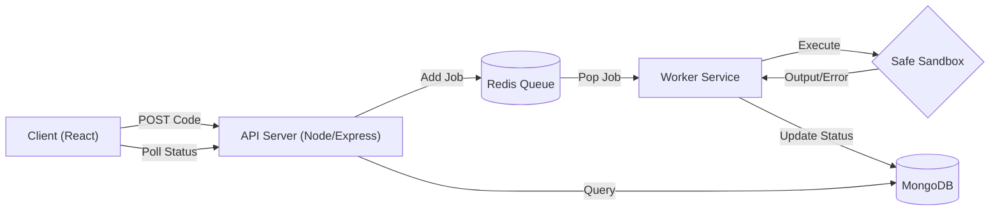

# ⚡ Remote Code Execution Engine (RCE)


> **A high-performance, asynchronous remote code execution platform capable of running untrusted user code in a secure, isolated environment.**

🔗 **Live Demo:** [http://139.59.80.142/]  

---

## 🚀 Overview

This project is a scalable **Distributed Job Processing System** designed to execute arbitrary user code (Python, C++, Java, JavaScript) safely. It mimics the core architecture of platforms like **LeetCode** or **HackerRank**.

Unlike simple CRUD apps, this system handles **concurrency, race conditions, and resource isolation** using a decoupled microservices architecture.

### 🎯 Key Engineering Highlights
* **Asynchronous Processing:** Decoupled the API from the Execution Engine using **Redis Queues (BullMQ)** to handle high traffic spikes without blocking.
* **Fault Tolerance:** Implemented robust error handling and retry mechanisms; if a worker crashes, the job is not lost.
* **Security & Isolation:** Executes code in ephemeral environments (Docker containers) with strict timeouts and memory limits to prevent infinite loops and Fork Bombs.
* **Real-time Feedback:** efficient polling mechanism with **HTTP 304 Caching** strategies to minimize bandwidth usage while fetching job status.

---

## 🛠️ System Architecture

The system is split into three distinct services to ensure scalability and separation of concerns:



🛡️ Security & Performance Challenges Solved: 

1. The "Infinite Loop" Problem
Challenge: A user submits while(true) {}. A naive implementation would freeze the worker server forever. Solution: Implemented Time Limits (TLE) using child_process timeouts. Any process running longer than 45s is SIGKILL'd automatically.

2. Output Buffering & Race Conditions
Challenge: C++ std::cout buffers output, causing system() calls to appear out of order or vanish if the program crashes. Solution: Enforced strict buffer flushing and implemented a custom stderr capture stream to ensure users see exactly why their code failed (e.g., Segmentation Faults).

3. Preventing System Access (RCE)
Challenge: Users trying to run rm -rf / or access server secrets. Solution: The execution engine runs code inside a non-root Docker container (or restricted environment) with no network access and read-only file systems where possible.

⚡ How to Run Locally
Prerequisites
Node.js v18+

Docker Desktop (running)

Redis (local or cloud URL)

MongoDB URI

Installation :

1 .Clone the Repo

 ```bash
git clone [https://github.com/yourusername/sandboxed-code-execution-platform.git](https://github.com/yourusername/sandboxed-code-execution-platform.git)
cd sandboxed-code-execution-platform
```
2. Start the Backend (API)

```bash
cd backend-api
npm install
# Create .env with MONGO_URI and REDIS_URL
node index.js
```
3. Start the worker

```bash
cd ../worker
npm install
# Create .env (Same credentials)
node src/worker.js
```

4. Start Frontend

```bash
cd ../frontend
npm install
npm run dev
```


